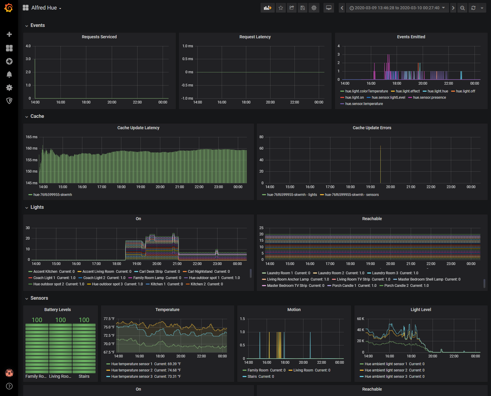

# homelab-hue

> A project focused on exposing information about Philips Hue devices to an event bus.

## Hardware Requirements

### Required

To get started, you'll need at least the following hardware:

1. Philips Hue Bridge (version 3+ is preferable) - [Amazon Link](https://www.amazon.com/Philips-Hue-Stand-Alone-Bridge/dp/B016H0QZ7I/ref=sr_1_2?keywords=philips+hue+bridge&qid=1583457327&sr=8-2)

### Optional

I've tested all of the following Philips Hue Accessories with success:

1. Philips Hue Indoor Motion Sensor - [Amazon Link](https://www.amazon.com/Philips-Motion-Sensor-Installation-Free-Exclusively/dp/B076MGK22M/ref=sr_1_2?keywords=philips+hue+sensor&qid=1583457364&sr=8-2)
1. Philips Hue Smart Bulb - [Amazon Link](https://www.amazon.com/Philips-464487-Equivalent-Compatible-Assistant/dp/B01M9AU8MB/ref=sr_1_7?keywords=philips+hue+light&qid=1583457406&sr=8-7)
1. Philips Hue LightStrip Plus - [Amazon Link](https://www.amazon.com/Philips-Ambiance-LightStrip-Compatible-Assistant/dp/B0167H33DU/ref=sr_1_2?keywords=philips+hue+lightstrip&qid=1583457563&sr=8-2)
1. Philips Hue Smart Spot Lights - [Amazon Link](https://www.amazon.com/Philips-Ambiance-Outdoor-mounting-Assistant/dp/B07DBGW73T/ref=sr_1_1?keywords=philips+hue+out&qid=1583458098&sr=8-1)
1. Philips Hue Outdoor Motion Sensor - [Amazon Link](https://www.amazon.com/Philips-Hue-Outdoor-Wireless-Required/dp/B07VRK6RXR/ref=sr_1_16?keywords=philips+hue+outdoor&qid=1583458139&sr=8-16)

## Environment Variables

| Name | Description | Default Value |
|:--|:--|:--|
| `NATS_SERVER` | The NATS connection URL used when connecting to the NATS cluster/server. | `"nats://127.0.0.1:4222"` |
| `HUE_BRIDGE_ADDRESS` | The host or IP address of the Philips Hue Bridge you're configured homelab-hue to connect to | `""` |
| `HUE_USER_ID` | The generated Philips Hue User ID you acquire when pairing your application with the Philips Hue Bridge | `""` |
| `METRICS_PORT` | The port that will be used for hosting the Prometheus metrics endpoint | `9200` |

## NATS Events Published

Here is a list of the events published to the event bus on state change:

- `hue.light.name`
- `hue.light.softwareVersion`
- `hue.light.on`
- `hue.light.off`
- `hue.light.reachable`
- `hue.light.unreachable`
- `hue.light.brightness`
- `hue.light.hue`
- `hue.light.saturation`
- `hue.light.xy`
- `hue.light.colorTemperature`
- `hue.light.effect`
- `hue.light.transitionTime`
- `hue.light.colorMode`
- `hue.sensor.name`
- `hue.sensor.softwareVersion`
- `hue.sensor.on`
- `hue.sensor.off`
- `hue.sensor.battery`
- `hue.sensor.reachable`
- `hue.sensor.unreachable`
- `hue.sensor.lightLevel`
- `hue.sensor.dark`
- `hue.sensor.daylight`
- `hue.sensor.presence`
- `hue.sensor.temperature`
